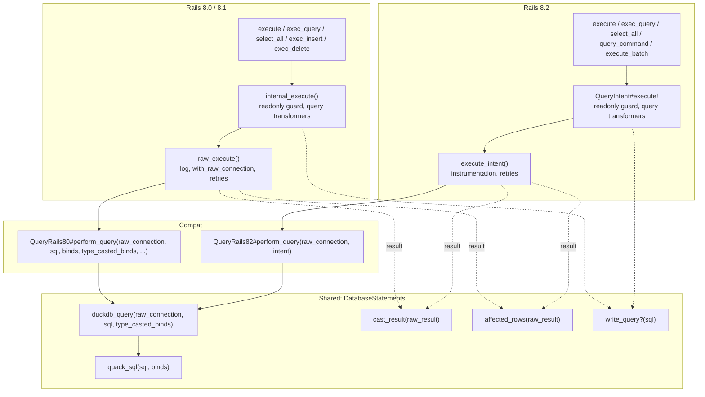
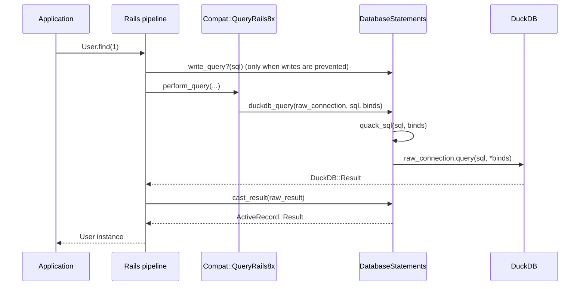
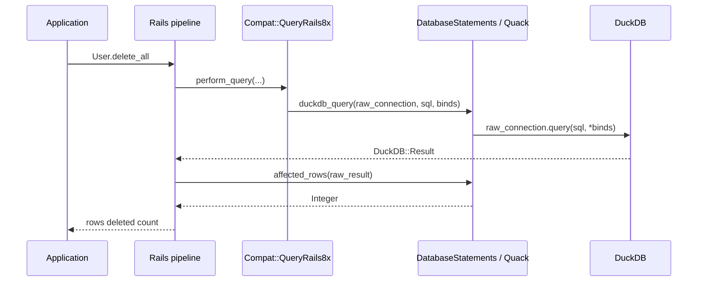

# Query Execution Call Graph

This document maps the query execution methods in the DuckDB adapter and how they plug into Rails' query pipeline. For why the adapter is split this way across Rails versions, see [RAILS_QUERY_EXECUTION.md](RAILS_QUERY_EXECUTION.md).

## Overview

The adapter implements only the lowest hook of Rails' query pipeline, `perform_query`. Rails supplies everything above it: logging, retries, warnings, query transformers, and the readonly guard. The signature of `perform_query` changed in Rails 8.2, so one small module per signature adapts it to the shared `duckdb_query`.

## Architecture



## Query Flow Examples

### SELECT Query



### DELETE Query



## Design Decisions

### 1. One Hook, Two Signatures

The adapter used to override `raw_execute`, which bypassed parts of Rails' pipeline and had to be rewritten for each Rails version. Rails 8.0 and 8.1 already call `perform_query` from `raw_execute`, and Rails 8.2 kept the name with a new signature. Implementing only `perform_query` keeps the Rails-specific code to one method per signature. It also gives every Rails version the same logging, retries, and readonly guard.

### 2. DuckDB DELETE Returns Count in Result Set

DuckDB's DELETE and UPDATE statements return the affected row count as a result set:

```sql
DELETE FROM users WHERE id = 1;
-- Returns: columns=["Count"], rows=[[1]]
```

It is also available through `result.rows_changed`, which `affected_rows` reads. A statement funneled to a Quack server reports its count only in the `Count` column. So `Quack#affected_rows` reads that column for funneled writes.

### 3. Transaction Control Uses the Pipeline

`begin_db_transaction`, `commit_db_transaction`, and `exec_rollback_db_transaction` call `transaction_command`, which runs the statement through the pipeline (`internal_execute` on 8.0/8.1, `query_command` on 8.2). The statement reaches `duckdb_query` like any other. So on a Quack connection it runs in the server session, where the writes run.

## Method Overview

| Method | Location | Purpose |
|--------|----------|---------|
| `perform_query` | `Compat::QueryRails80` / `Compat::QueryRails82` | Rails' lowest execution hook |
| `transaction_command` | `Compat::QueryRails80` / `Compat::QueryRails82` | Run BEGIN, COMMIT, or ROLLBACK through the pipeline |
| `duckdb_query` | `DatabaseStatements` (private) | Run a statement on the raw DuckDB connection |
| `cast_result` | `DatabaseStatements` | Convert a DuckDB result to `ActiveRecord::Result` |
| `affected_rows` | `DatabaseStatements`, `Quack` | Row count of a raw result |
| `write_query?` | `DatabaseStatements` | Tell reads from writes for the readonly guard |
| `quack_sql` | `Quack` | Wrap a statement for the Quack funnel |

## Schema Statements

| Method | Location | Purpose |
|--------|----------|---------|
| `tables` | Shared | List all tables |
| `indexes` | Shared | List indexes for a table, or per table for an Array |
| `primary_keys` | Shared | Primary key columns for a table, or per table for an Array |
| `table_options` | Shared | Options for the schema dump, or per table for an Array |
| `create_table` | Shared | Create a table and the sequence that fills its primary key |
| `create_sequence` | Shared | Create a DuckDB sequence |
| `type_to_sql` | Shared | Convert Rails types to DuckDB SQL |
| `new_column_from_field` | `Compat::ColumnRails80` / `Compat::ColumnRails81` | Create a Column from DB metadata |
| `fetch_type_metadata` | Shared | Parse DuckDB type strings |
